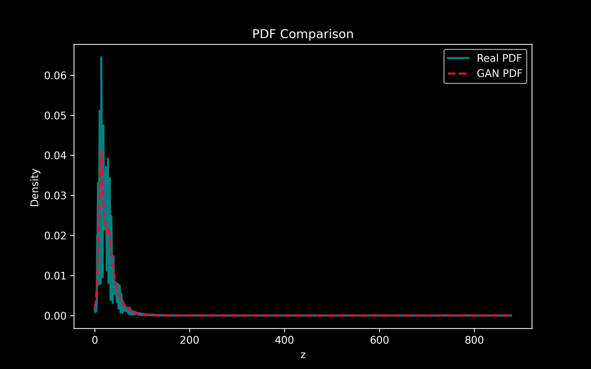
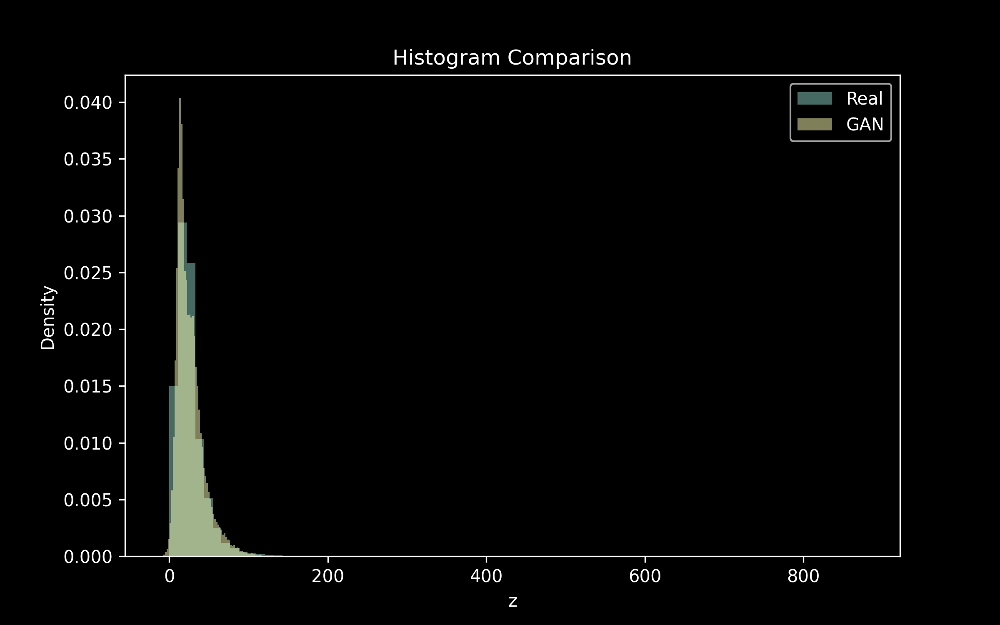
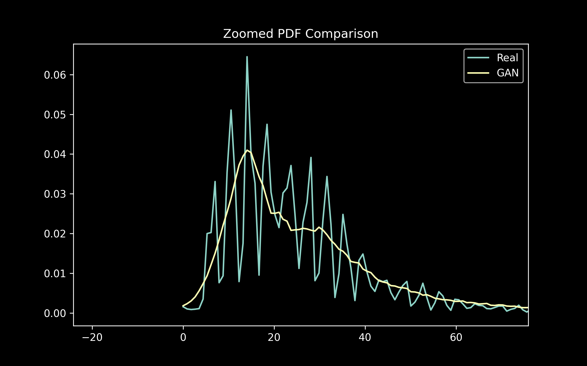

# PDF_using_GAN_by_Avneet_Sandhu

## 📌 Objective
To learn the unknown probability density function (PDF) of a transformed NO₂ concentration variable using a Generative Adversarial Network (GAN).

---

## 📊 Dataset
Feature used:
- **NO₂ concentration** (`no2` column)

---

## 🔄 Transformation

The original variable `x` is transformed into:

z = x + a_r * sin(b_r * x)

Where:

- a_r = 0.5 × (r mod 7)
- b_r = 0.3 × (r mod 5 + 1)

For roll number: **102303289**

- a_r = 2.0
- b_r = 1.5

---

## 🧠 Methodology

1. Data preprocessing
2. Transformation of NO₂ values
3. Standardization of data
4. GAN training:
   - Generator network
   - Discriminator network
5. Generation of fake samples
6. PDF estimation using Kernel Density Estimation (KDE)
7. Comparison of real vs GAN learned distribution

---

## 📈 Results

### 🔹 PDF Comparison

---

### 🔹 Histogram Comparison

---

### 🔹 Zoomed PDF Comparison

---

## 📂 Repository Structure

